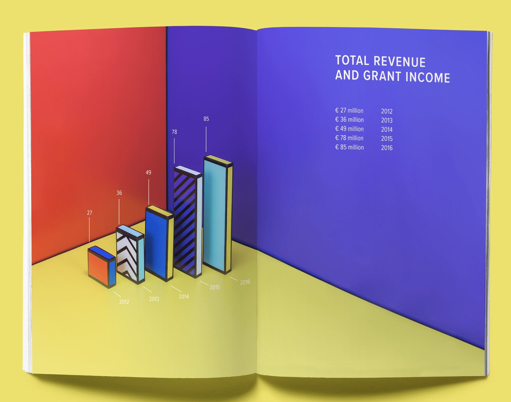

# Data Visualization

## Assignment 2: Good and Bad Data Visualization

### Requirements:

- Data visualizations are important tools for communication and convincing; we need to be able to evaluate the ways that data are presented in visual form to be critical consumers of information 
- To test your evaluation skills, locate two public data visualizations online, one good and one bad  
    - You can find data visualizations at https://public.tableau.com/app/discover or https://datavizproject.com/, or anywhere else you like! 
- For each visualization (good and bad): 
    - explain why its good or bad. And ways in which it can be improved. 

#### Good Image  


From: https://www.datacamp.com/blog/data-visualization-examples

    ```
    I classified this as a good visualization (using the questions based on slide 23,24, presentation 01). 

    It was pleasing to look at due to the clarity and its use of yellow. This makes sense with the theme of the 'sunflowers' since it matches that yellow colour. 

    It did appear to be accurate and represented the data clearly. Each bar represents a count of individual sunflower sprouts of that particular height in cm. The mean appears to be around 24.7, with the mode being 26.0. The data are binned, so any individual sunflower's height would not be extractable from this figure, however it might be a negligible difference.  

    I thought that it was clear to look at, I was able to tell what the figure was about by looking at the title, axies. There was a clear use of colour - not too many colours or anything distracting. There were also units on the axies as well, so that I could understand what the numbers actually meant.

    Context: the context for this is an example for an academic journal/academic communication

    Audience: would be those studying sunflower height growth or potentially those who are working in the field as gardners. 

    Data Structure: captures the distribution of our data - what are the patterns of heights of our sunflower sample? Gives us some insight as to what is normal and non-normal growth for this sample. Allows us to compare to other samples or spot outliers.      
      ```
 __How could this data visualization have been improved?__  
    
    ```
    To improve this visualization, there are two major suggestions for improvement. I used the APA guidelines for figures to help guide me as well as suggestions from cognitive psychology (slides 37-46, presentation 04).

    I would add faint horizontal gridlines to improve ease of looking at the numbers for each bar. The other option would be to put a count above each bar (though this can get really cluttered quickly). 
     
    I would also make the x-axis progress in a more standardized increment. It is currently going up by either 1.3 cm or 1.4 cm. This is problematic for two reasons: first the bins are not the same size, which makes comparison of the bars not equal. It also makes it hard for a human to read and understand the bins themselves since 1.4 and 1.3 are not numbers that can be easily parsed. Both of these make the figure less clear. I would increase it by 1.0 cm  or 1.5 cm. There is a general rule to try to have between 15-20 bars for readability, so I would aim for that. I would also consider adding vertical lines on the figure and labels to indicate the mean, median and mode since those are often useful statistics when looking at histograms. 
    ```

#### Bad Image 


      From: https://datavizproject.com/wp-content/uploads/examples/Sk%C3%A6rmbillede-2017-09-27-kl.-10.49.51.png 

    ```
    I classified this as a bad visualization (using the questions based on slide 23,24, presentation 01). 

    This is not aesthetically appealing - it uses clashing colours, unnessary 3D effects and lots of distracting patterns. 

    The use of data labels allows for comparison, but lack of axies makes it really hard to tell if the comparison is visually matching up to the numbers. It is not clear if the baseline starts at 0 or not. It does not have a source either so that also makes it somewhat unclear where the data is coming from. 

    It is somewhat clear that the message is that the total revenue and grant income is increasing each year, but the data labels convey this and the actual graph is not really necessary or helpful in conveying this information. Unclear who/which institute the data is referring to? 
     ```
    
- __How could this data visualization have been improved?__  
```
To improve this visualization, there are two several suggestions for improvement. I used the APA guidelines for figures to help guide me as well as suggestions from cognitive psychology (slides 37-46, presentation 04).

1. Remove background colours and make it one colour. Removing colour across the whole figure would be also helpful since there is no need for it and it is visually distracting. 

2. Making the figure 2D with a visible x-axis and y-axis would greatly help to clarify the figure. Units on the axis would also be necessary. 

3. Adding in a source to indicate where the data is coming from and what it is referring to (whose revenue and grant income is it?)

4. Make the font readable colour. It is currently white on yellow background for the year, which is really hard to read. 

5. Once that is all done, then I would remove the table showing the same information again. It is redundant and unnecessary.
``` 


- Word count should not exceed (as a maximum) 500 words for each visualization (i.e. 300 words for your good example and 500 for your bad example)

### Why am I doing this assignment?:

- This assignment ensures active participation in the course, and assesses the learning outcomes
* Apply general design principles to create accessible and equitable data visualizations
* Use data visualization to tell a story

### Rubric:

| Component               | Scoring   | Requirement                                                 |
|-------------------------|-----------|-------------------------------------------------------------|
| Data viz classification and justification | Complete/Incomplete | - Data viz are clearly classified as good or bad<br />- At least three reasons for each classification are provided<br />- Reasoning is supported by course content or scholarly sources |
| Suggested improvements  | Complete/Incomplete | - At least two suggestions for improvement<br />- Suggestions are supported by course content or scholarly sources |

## Submission Information

🚨 **Please review our [Assignment Submission Guide](https://github.com/UofT-DSI/onboarding/blob/main/onboarding_documents/submissions.md)** 🚨 for detailed instructions on how to format, branch, and submit your work. Following these guidelines is crucial for your submissions to be evaluated correctly.

### Submission Parameters:
* Submission Due Date: `23:59 -  2026-06-09`
* The branch name for your repo should be: `assignment-2`
* What to submit for this assignment:
    * This markdown file (assignment_2.md) should be populated and should be the only change in your pull request.
* What the pull request link should look like for this assignment: `https://github.com/<your_github_username>/visualization/pull/<pr_id>`
    * Open a private window in your browser. Copy and paste the link to your pull request into the address bar. Make sure you can see your pull request properly. This helps the technical facilitator and learning support staff review your submission easily.

Checklist:
- [ ] Create a branch called `assignment-2`.
- [ ] Ensure that the repository is public.
- [ ] Review [the PR description guidelines](https://github.com/UofT-DSI/onboarding/blob/main/onboarding_documents/submissions.md#guidelines-for-pull-request-descriptions) and adhere to them.
- [ ] Verify that the link is accessible in a private browser window.

If you encounter any difficulties or have questions, please don't hesitate to reach out to our team via our Slack. Our Technical Facilitators and Learning Support staff are here to help you navigate any challenges.
